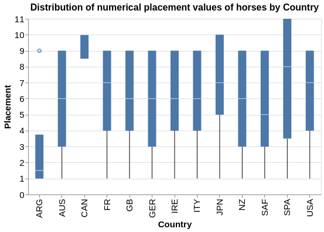
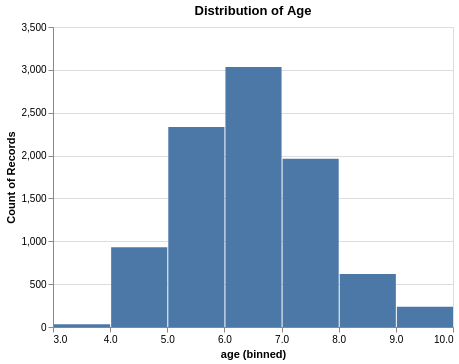

Hong Kong Horse Racing Predictions
================
Derek Kruszewski, Yi Liu, Rob Blumberg, Carlina Kim  
2020/01/24 (updated: 2020-02-01)

-   [Introduction](#introduction)
-   [Exploratory Data Analysis](#exploratory-data-analysis)
    -   [1. Let's observe some features relationship with one another](#lets-observe-some-features-relationship-with-one-another)
    -   [2. Let's see the `country` and `age` distribution of the race horses](#lets-see-the-country-and-age-distribution-of-the-race-horses)
    -   [3. Let's see the how `winodds` features influences the `placement` of the race horse](#lets-see-the-how-winodds-features-influences-the-placement-of-the-race-horse)
-   [Analysis](#analysis)
-   [References](#references)

Introduction
------------

Hong Kong horse racing bets contributed a staggering $15.8 billion USD turnover for 2017-2018 (Ng 2018). With such large amounts of money being wagered, it **spurs** the question: "Given a set of features related to racing horses, can we predict the outcome of a race?".

A publically available dataset with Hong Kong horse racing statistics is available on Kaggle (HorseBaby 2018) for 2015-2017. The data set author mentions that this data was compiled from The Hong Kong Jockey Club (“Hong Kong Jockey Club,” n.d.). This dataset was utilized to create a predictive model for horse performance. The following report sections explore this data and comment on the success of said model.

The R and Python programming languages were used in this analysis (R Core Team 2019; Van Rossum and Drake 2009). Python packages used in the analysis include: pandas (McKinney 2010), docopt (Keleshev 2014), numpy (Oliphant 2006–2006--), scikit-learn (Pedregosa et al. 2011), altair (VanderPlas et al. 2018), pandas profiling (Brugman 2019), matplotlib (Hunter 2007), selenium (Salunke 2014), and seaborn (citation still under development). R packages used in this analysis include: knitr (Xie 2014), docopt (de Jonge 2018), and tidyverse (Wickham 2017).

Exploratory Data Analysis
-------------------------

The data set used contains five sub sets (.csv files): `results`, `barrier`, `comments`, `horse_info`, and `trackwork`. Results contain horse racing placement information from official races (race outcomes, pre-race conditions). Comments contains text on the performance of each horse during official races, and horse\_info contains specifications for the horses participating in races (features include name, country of origin, sex and age).

The barrier data set includes practice runs completed by horses. Since this information is useful in predicting future track performance, it was included along with results as race observations. The results race data contains all the same features as the barrier set; however the barrier practice runs are missing ~20% of the features that are in results such as `actualwt`, `class`, and `handicap`. In order to be able study if practice runs are biased, these practice runs are labelled in the final data set so that observations are known to be either an official race or practice. Trackwork contains warmup and exercise routines for horses throughout the time period of the data set (2015-2017). This data set was tentatively omitted because it is difficult to incorporate into the master data set. The set contains 648,000 rows.

##### 1. Let's observe some features relationship with one another

To understand the 36 different features relationship's with one another, we observed a correlation plot on a selection of features.

The plot show that there aren't many highly correlated features. The one pair of highly correlated features (0.96) are `current_rating` and `start_rating`. `Current_rating` is the rating system for determining handicaps and `start_rating` displays the previous rating of the particular horse. There also seem to be more negatively correlated features than positively correlated ones. Some pairs to mention are `class` which is the quality of the race (1=championship) and `race_no` which is the race number of the day with a negative correlation value of -0.68. `Class` and `start_rating` had a negtive correlation value of -0.7, while `horseno`, the index number given to the horse at the race and `actualwt` which is the weight carried during the race (horse + jockey + gear) has a -0.8 correlation. With better understanding of our features, we can remove unnecessary features and view relationships on the more prevalent ones.

##### 2. Let's see the `country` and `age` distribution of the race horses

The race horses came from Argentina, Australia, Canada, France, Great Britain, Germany, Italy, Ireland, Japan, New Zealand, South Africa, Spain, and USA.

The `age` of the race horses range from 3 to 10 years old.

##### 3. Let's see the how `winodds` features influences the `placement` of the race horse

We found the average placement of the horses in a race given their win odds value. It shows that higher win odds results in worse/higher placement.

Analysis
--------

To answer our research question, we created a model to predict horse race times from various features in the Hong Kong horse racing dataset. As such, this consisted in a regression tasks, and so we set out to produce a linear regression model.

Before taking a look at the results, the feature selection and optimizations steps will be discussed. To start off, the dataset contained a mix of 36 categorical and numeric features. There were main decisions that needed to be made with regards to these features: which ones to pick (1), and whether or not to transform our numeric features to high order polynomials (2). As it turned out, both challenges could be addressed with the same solution. First, the numeric features were transformed to 5th degree polynomials (including cross terms). Then, a recursive feature elimination (RFE) algorithm was applied, which selected which of the featues, both original and transformed, should be selected. To run the RFE, the number of features to select had to be specified. Thus, a grid search was done to optimize this hyperparameter, using the *R*2 correlation coefficent on the validation set as the scoring method. The results of the grid search are shown below.

|  \# features selected|  Mean R^2 val score|  Fit time per fold (s)|
|---------------------:|-------------------:|----------------------:|
|                    30|           0.8899682|               11.33035|
|                    28|           0.8898893|               11.23479|
|                    25|           0.8541786|               11.59339|
|                    22|           0.8540039|               27.28290|
|                    20|           0.8501507|               11.32917|
|                    18|           0.8485627|               11.13550|
|                    15|           0.7690264|               11.11716|
|                    12|           0.5909990|               11.54822|
|                    10|           0.5901957|               12.27619|

In the table above, we can see that after roughly 25-28 features selected, the mean R^2 validation score no longer increased. Therefore, a value of 25 was used as the number of features selected, and a linear model was trained with the 25 most predictive features given by RFE on the entire training set. The linear model was then used on the test data. The results are shown below.

Visually, it appears as though our linear regression model performs quite well compared to the theoretically perfect model represented by the red dashed line. The R^2 score in this case was 0.909. One thing to keep in mind, however, is that the order of finishes in a horse race can come down to fractions of a second, and so even a model capable of predicting finish times with an error of less than 1s can prove to be not very useful.

Another note to make about the results is that the prediction values seem to come in clusters. This suggests that the model may be segregating prediction values based on one feature (for instance, distance), and then fine tuning the predicted values based on other features. Therefore, the next step of this project would be to investigate this by looking more closely at the weights of our linear model. Additionally, this analysis could be extended by using predicted finish times to estimate race finish orders, and compare these predicted finishing positions to the actual ones.

References
----------

Brugman, Simon. 2019. “pandas-profiling: Exploratory Data Analysis for Python.” <https://github.com/pandas-profiling/pandas-profiling>.

de Jonge, Edwin. 2018. *Docopt: Command-Line Interface Specification Language*. <https://CRAN.R-project.org/package=docopt>.

“Hong Kong Jockey Club.” n.d. <https://racing.hkjc.com/racing/english/index.aspx>.

HorseBaby. 2018. “Horse Racing Dataset for Experts (Hong Kong).” <https://www.kaggle.com/hrosebaby/horse-racing-dataset-for-experts-hong-kong>.

Hunter, J. D. 2007. “Matplotlib: A 2d Graphics Environment.” *Computing in Science & Engineering* 9 (3). IEEE COMPUTER SOC: 90–95. doi:[10.1109/MCSE.2007.55](https://doi.org/10.1109/MCSE.2007.55).

Keleshev, Vladimir. 2014. *Docopt: Command-Line Interface Description Language*. <https://github.com/docopt/docopt>.

McKinney, Wes. 2010. “Data Structures for Statistical Computing in Python.” In *Proceedings of the 9th Python in Science Conference*, edited by Stéfan van der Walt and Jarrod Millman, 51–56.

Ng, Kang-chung. 2018. <https://www.scmp.com/news/hong-kong/society/article/2162085/hong-kong-jockey-club-hits-record-high-hk234-billion-turnover>.

Oliphant, Travis. 2006–2006--. “NumPy: A Guide to NumPy.” USA: Trelgol Publishing. <http://www.numpy.org/>.

Pedregosa, F., G. Varoquaux, A. Gramfort, V. Michel, B. Thirion, O. Grisel, M. Blondel, et al. 2011. “Scikit-Learn: Machine Learning in Python.” *Journal of Machine Learning Research* 12: 2825–30.

R Core Team. 2019. *R: A Language and Environment for Statistical Computing*. Vienna, Austria: R Foundation for Statistical Computing. <https://www.R-project.org/>.

Salunke, Sagar Shivaji. 2014. *Selenium Webdriver in Python: Learn with Examples*. 1st ed. North Charleston, SC, USA: CreateSpace Independent Publishing Platform.

Van Rossum, Guido, and Fred L. Drake. 2009. *Python 3 Reference Manual*. Scotts Valley, CA: CreateSpace.

VanderPlas, Jacob, Brian Granger, Jeffrey Heer, Dominik Moritz, Kanit Wongsuphasawat, Arvind Satyanarayan, Eitan Lees, Ilia Timofeev, Ben Welsh, and Scott Sievert. 2018. “Altair: Interactive Statistical Visualizations for Python.” *Journal of Open Source Software*, December. The Open Journal. doi:[10.21105/joss.01057](https://doi.org/10.21105/joss.01057).

Wickham, Hadley. 2017. *Tidyverse: Easily Install and Load the ’Tidyverse’*. <https://CRAN.R-project.org/package=tidyverse>.

Xie, Yihui. 2014. “Knitr: A Comprehensive Tool for Reproducible Research in R.” In *Implementing Reproducible Computational Research*, edited by Victoria Stodden, Friedrich Leisch, and Roger D. Peng. Chapman; Hall/CRC. <http://www.crcpress.com/product/isbn/9781466561595>.
