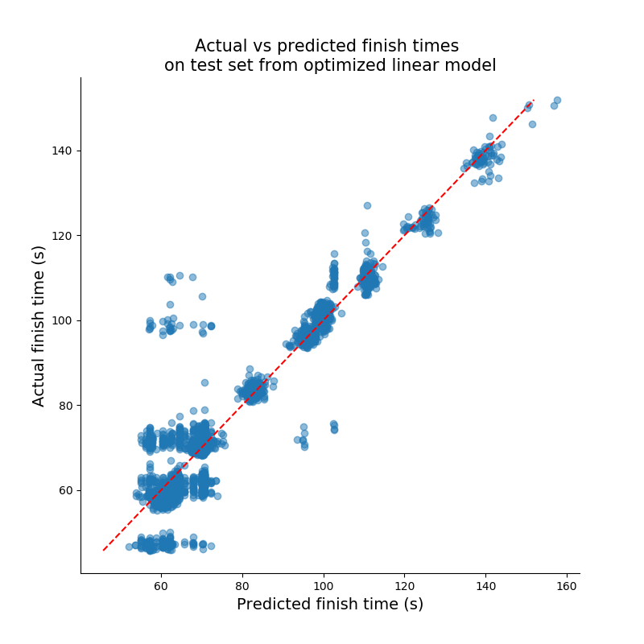

Hong Kong Horse Racing Predictions
================
Derek Kruszewski, Yi Liu, Rob Blumberg, Carlina Kim  
2020/01/24 (updated: 2020-01-24)

## Introduction

Hong Kong horse racing bets contributed a staggering $15.8 billion USD
turnover for 2017-2018 (Ng 2018). With such large amounts of money being
wagered, it **spurs** the question: “Given a set of features related to
racing horses, can we predict the outcome of a race?”.

A publically available dataset with Hong Kong horse racing statistics is
available on Kaggle (HorseBaby 2018) for 2015-2017. The data set author
mentions that this data was compiled from data from The Hong Kong Jockey
Club (“Hong Kong Jockey Club,” n.d.). This data was utilized to create a
predictive model for horse performance. The following report sections
explore this data and comment on the success of said model.

The R and Python programming languages were used in this analysis (R
Core Team 2019; Van Rossum and Drake 2009). Python packages used in the
analysis include: pandas (McKinney 2010), docopt (Keleshev 2014), numpy
(Oliphant, n.d.), scikit-learn (Pedregosa et al. 2011), altair
(VanderPlas et al. 2018), pandas profiling (Brugman 2019), matplotlib
(Hunter 2007), and seaborn (citation still under development). R
packages used in this analysis include: knitr (Xie 2014), and docopt (de
Jonge 2018).

## Exploratory Data Analysis

  - Introduce data set

## Analysis

To answer our research question, we created a model to predict horse
race times from various features in the Hong Kong horse racing dataset.
As such, this consisted in a regression tasks, and so we set out to
produce a linear regression model.

Before taking a look at the results, the feature selection and
optimizations steps will be discussed. To start off, the dataset
contained a mix of 36 categorical and numeric features. There were main
decisions that needed to be made with regards to these features: which
ones to pick (1), and whether or not to transform our numeric features
to high order polynomials (2). As it turned out, both challenges could
be addressed with the same solution. First, the numeric features were
transformed to 5th degree polynomials (including cross terms). Then, a
recursive feature elimination (RFE) algorithm was applied, which
selected which of the featues, both original and transformed, should be
selected. To run the RFE, the number of features to select had to be
specified. Thus, a grid search was done to optimize this hyperparameter,
using the \(R^2\) correlation coefficent on the validation set as the
scoring method. The results of the grid search are shown below.

| \# features selected | Mean R^2 val score | Fit time per fold (s) |
| -------------------: | -----------------: | --------------------: |
|                   10 |          0.5901863 |              9.672375 |
|                   12 |          0.5909740 |             10.297963 |
|                   15 |          0.7616606 |             10.777402 |
|                   18 |          0.7786950 |             11.721035 |
|                   20 |          0.7806217 |             11.285953 |
|                   22 |          0.8142325 |             11.255684 |
|                   25 |          0.8183563 |              8.798189 |
|                   28 |          0.8838182 |              8.774265 |
|                   30 |          0.8864633 |              8.837209 |

In the table above, we can see that after roughly 25-28 features
selected, the mean R^2 validation score no longer increased. Therefore,
a value of 25 was used as the number of features selected, and a linear
model was trained with the 25 most predictive features given by RFE on
the entire training set. The linear model was then used on the test
data. The results are shown
below.

Visually, it appears as though our linear regression model performs
quite well compared to the theoretically perfect model represented by
the red dashed line. The R^2 score in this case was 0.909. One thing to
keep in mind, however, is that the order of finishes in a horse race can
come down to fractions of a second, and so even a model capable of
predicting finish times with an error of less than 1s can prove to be
not very useful.

Another note to make about the results is that the prediction values
seem to come in clusters. This suggests that the model may be
segregating prediction values based on one feature (for instance,
distance), and then fine tuning the predicted values based on other
features. Therefore, the next step of this project would be to
investigate this by looking more closely at the weights of our linear
model. Additionally, this analysis could be extended by using predicted
finish times to estimate race finish orders, and compare these predicted
finishing positions to the actual ones.

## References

Brugman, Simon. 2019. “pandas-profiling: Exploratory Data Analysis for
Python.” <https://github.com/pandas-profiling/pandas-profiling>.

de Jonge, Edwin. 2018. *Docopt: Command-Line Interface Specification
Language*. <https://CRAN.R-project.org/package=docopt>.

“Hong Kong Jockey Club.” n.d.
<https://racing.hkjc.com/racing/english/index.aspx>.

HorseBaby. 2018. “Horse Racing Dataset for Experts (Hong Kong).”
<https://www.kaggle.com/hrosebaby/horse-racing-dataset-for-experts-hong-kong>.

Hunter, J. D. 2007. “Matplotlib: A 2D Graphics Environment.” *Computing
in Science & Engineering* 9 (3). IEEE COMPUTER SOC: 90–95.
<https://doi.org/10.1109/MCSE.2007.55>.

Keleshev, Vladimir. 2014. *Docopt: Command-Line Interface Description
Language*. <https://github.com/docopt/docopt>.

McKinney, Wes. 2010. “Data Structures for Statistical Computing in
Python.” In *Proceedings of the 9th Python in Science Conference*,
edited by Stéfan van der Walt and Jarrod Millman, 51–56.

Ng, Kang-chung. 2018.
<https://www.scmp.com/news/hong-kong/society/article/2162085/hong-kong-jockey-club-hits-record-high-hk234-billion-turnover>.

Oliphant, Travis. n.d. “NumPy: A Guide to NumPy.” USA: Trelgol
Publishing. <http://www.numpy.org/>.

Pedregosa, F., G. Varoquaux, A. Gramfort, V. Michel, B. Thirion, O.
Grisel, M. Blondel, et al. 2011. “Scikit-Learn: Machine Learning in
Python.” *Journal of Machine Learning Research* 12: 2825–30.

R Core Team. 2019. *R: A Language and Environment for Statistical
Computing*. Vienna, Austria: R Foundation for Statistical Computing.
<https://www.R-project.org/>.

VanderPlas, Jacob, Brian Granger, Jeffrey Heer, Dominik Moritz, Kanit
Wongsuphasawat, Arvind Satyanarayan, Eitan Lees, Ilia Timofeev, Ben
Welsh, and Scott Sievert. 2018. “Altair: Interactive Statistical
Visualizations for Python.” *Journal of Open Source Software*, December.
The Open Journal. <https://doi.org/10.21105/joss.01057>.

Van Rossum, Guido, and Fred L. Drake. 2009. *Python 3 Reference Manual*.
Scotts Valley, CA: CreateSpace.

Xie, Yihui. 2014. “Knitr: A Comprehensive Tool for Reproducible Research
in R.” In *Implementing Reproducible Computational Research*, edited by
Victoria Stodden, Friedrich Leisch, and Roger D. Peng. Chapman;
Hall/CRC. <http://www.crcpress.com/product/isbn/9781466561595>.

